# 工程师工具台 Engineering Toolbox Center

> 一个面向工程师日常数据处理、文档整理和工具聚合的 Python 桌面应用。  
> 出于工业业务保密性原因，本仓库为展示用预览版，仅包含项目说明、脱敏架构信息与界面截图，不公开私有业务源码。

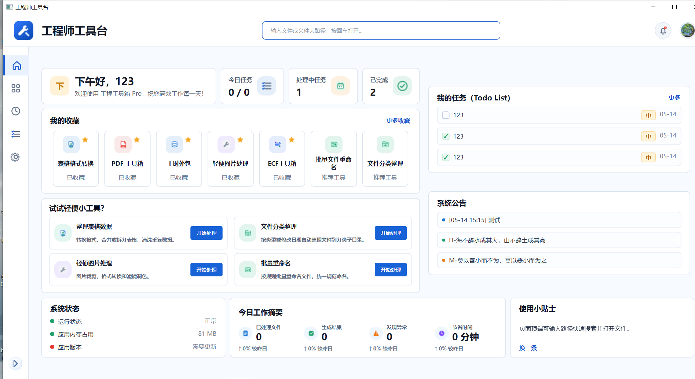

## 项目定位

工程师工具台是一套集成式桌面工作台，目标是把工程师日常高频、分散、重复的文件处理任务收拢到一个统一入口中。应用围绕表格、PDF、图片、文件整理、ECF 测试数据处理、待办事项和公告管理等场景提供可视化工具，减少手工操作和跨软件切换成本。

这个项目不是单个脚本工具，而是按桌面产品形态设计的完整应用：包含主窗口、导航路由、工具中心、页面组件、业务服务、本地配置、主题样式、图标资源和自动化测试。

## 作品亮点

- **完整桌面应用架构**：基于 PySide6 构建主窗口、页面路由、左侧导航、顶部路径入口和多页面工作区。
- **模块化工具体系**：将 UI 页面、业务逻辑、通用服务和资源样式拆分维护，便于继续扩展新工具。
- **工程数据处理能力**：覆盖 ECF TXT 报告、前后测试对比、温箱数据合并、温箱曲线绘制、功能曲线绘制等工程场景。
- **批量文件自动化**：实现表格格式转换、PDF 合并拆分、图片转 PDF、图片裁剪/转换/调色、批量重命名和文件分类整理。
- **本地化产品体验**：支持收藏、最近使用、Todo List、公告、主题切换、头像、窗口尺寸记忆和侧边栏折叠状态。
- **可测试的服务层设计**：核心处理逻辑拆到 service/module 层，配套单元测试，降低 UI 与业务耦合。

## 技术栈

| 类型 | 技术 |
| --- | --- |
| 语言 | Python 3.12+ |
| 桌面 GUI | PySide6 |
| 依赖管理 | uv |
| 表格处理 | openpyxl |
| PDF 处理 | pypdf |
| 图片处理 | Pillow |
| 系统状态 | psutil |
| 测试 | unittest |
| 样式与资源 | QSS、SVG icons |

## 源码结构概览

出于隐私原因，源码不随本预览仓库公开；下面展示的是脱敏后的项目结构和职责说明，用于体现工程组织方式。

```text
main.py                         # 程序入口，创建 QApplication 与主窗口
app/
  core/
    app_config.py               # 应用名称、版本、资源路径、主题加载等配置
    router.py                   # 工具入口元数据与路由注册
  ui/
    main_window.py              # 主窗口框架：顶部栏、侧边栏、页面容器
    pages/                      # 各功能页面，共 18 个页面文件
      home_page.py              # 首页工作台
      tool_center_page.py       # 工具中心
      file_converter_page.py    # 表格格式转换
      pdf_toolbox_page.py       # PDF 工具箱
      batch_file_renamer_page.py# 批量文件重命名
      file_organizer_page.py    # 文件分类整理
      image_processor_page.py   # 轻便图片处理
      ecf_toolbox_page.py       # ECF 工具箱入口
      comparison_report_page.py # 前后测试报告
      txt_report_page.py        # TXT 测试报告
      data_concat_page.py       # 温箱数据合并
      temp_chamber_plot_page.py # 温箱数据绘图
      function_curve_page.py    # 功能曲线绘制
      work_hours_outsourcing_page.py
      todo_list_page.py
      recent_usage_page.py
      announcement_edit_page.py
      settings_page.py
    widgets/
      tool_card.py              # 工具卡片等复用组件
  modules/                      # 业务能力模块
    file_converter/
    pdf_toolbox/
    batch_file_renamer/
    file_organizer/
    image_processor/
    ecf_toolbox/
    todo/
    recent_usage/
    announcements/
    work_summary/
  services/                     # 通用服务层
    settings_service.py
    favorite_service.py
    who_binding_service.py
    file_service.py
    log_service.py
  resources/
    icons/                      # 40+ SVG 图标资源
    qss/                        # 浅色 / 深色主题样式
  config/
    settings.yaml
tests/                          # unittest 测试用例
docs/                           # 需求与设计文档
data_demo/                      # 脱敏演示数据
```

项目当前包含约 **66 个 Python 源码/测试文件**、约 **1.8 万行代码**，并为主要服务模块配套了 **16 个测试文件**，覆盖文件转换、PDF、重命名、文件整理、ECF 数据处理、设置、收藏、最近使用、公告、Todo 和工作量统计等逻辑。

## 架构设计

项目采用偏 MVC/MVVM 的分层思路：

- **UI 层**：负责窗口布局、交互控件、页面状态展示和用户输入收集。
- **模块层**：承载具体工具的业务逻辑，例如 PDF 处理、图片处理、ECF 报告生成等。
- **服务层**：沉淀跨页面复用能力，例如设置、收藏、最近使用、公告、外部程序绑定等。
- **资源层**：统一管理 SVG 图标、QSS 样式表和配置文件，使界面风格可维护。
- **测试层**：围绕服务和核心数据处理逻辑编写测试，保证文件操作、数据转换和统计逻辑可回归。

这种拆分让新增工具的流程比较清晰：新增业务模块、创建页面、注册路由、补充图标与测试即可接入工具中心。

## 功能模块

| 模块 | 主要功能 | 典型场景 |
| --- | --- | --- |
| 首页工作台 | 收藏工具、推荐工具、待办摘要、公告、系统状态、今日工作摘要 | 日常进入应用后的快捷总览 |
| 工具中心 | 工具检索、分类筛选、收藏、状态展示 | 快速找到并启动目标工具 |
| 表格格式转换 | Excel、CSV、TSV、TXT 相互转换，转换前预览，支持保存到源目录或自定义目录 | 工程数据格式统一 |
| PDF 工具箱 | 合并 PDF、拆分 PDF、图片转 PDF，支持列表排序和移除 | 测试报告、扫描件和图片资料归档 |
| 轻便图片处理 | 图片裁剪、格式转换、滤镜调色，支持坐标微调和预览 | 快速处理截图、头像和报告插图 |
| 批量文件重命名 | 按文件类型识别，支持前缀、后缀、自定义文字、时间、序号和预览 | 规范测试数据和交付文件命名 |
| 文件分类整理 | 按文件类型或修改日期整理到分类目录，支持预览和撤销 | 清理项目目录、归档交付文件 |
| ECF 工具箱 | 报告生成、前后测试报告、温箱数据合并、温箱数据绘图、功能曲线绘制 | ECF 相关测试数据整理与报告输出 |
| 工时外包 | 绑定本地外部工具程序，扫描常用位置，打开工具、复制路径、打开所在目录 | 管理本地辅助程序和外包流程入口 |
| Todo List | 新增任务、设置日期和优先级、勾选完成、清理已完成 | 记录轻量工作事项 |
| 公告管理 | 管理和展示系统公告 | 团队通知和版本提示 |
| 设置 | 用户资料、头像、主题、窗口行为、侧边栏行为、本地配置路径展示 | 个性化与本地偏好管理 |

## 界面预览

### 工具中心

工具中心是应用的功能目录页，用于搜索、分类浏览和识别工具状态。页面展示全部工具、已启用工具和规划中工具的数量统计，并提供收藏夹、表格处理、PDF 工具、文件工具、ECF 工具箱、计划识别、数据工具、图片工具等分类筛选。

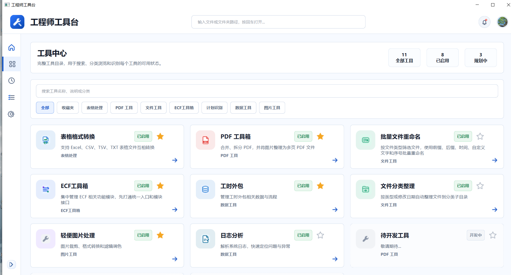

### 表格格式转换

支持拖入或选择 Excel、CSV、TSV、TXT 文件，并转换为指定目标格式。界面包含待转换文件列表、转换前预览和输出位置选择，适合批量整理工程数据表。

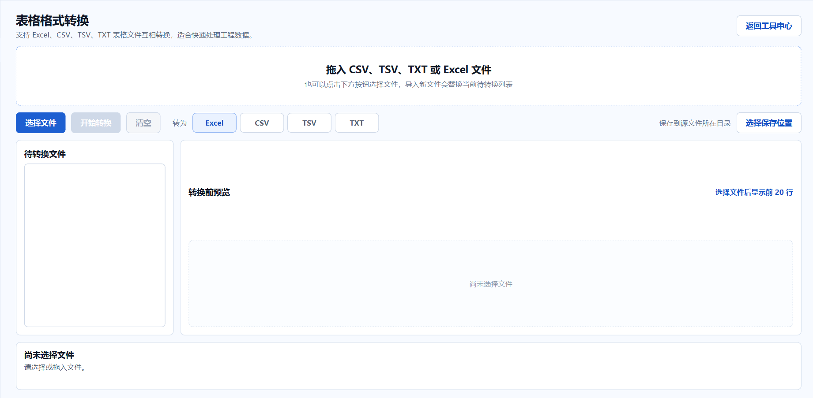

### PDF 工具箱

提供合并 PDF、拆分 PDF 和图片转 PDF 三种模式。合并模式下可添加多个 PDF，调整顺序后生成新的 PDF 文件。

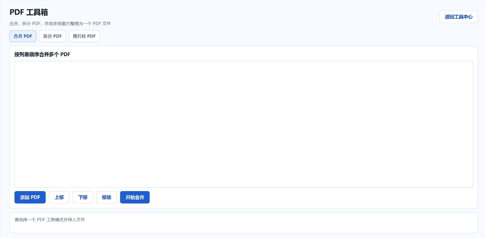

### 轻便图片处理

图片处理工具包含裁剪、格式转换和滤镜调色。裁剪模式支持在预览区拖拽选区，也支持在左侧通过坐标输入做精确调整。

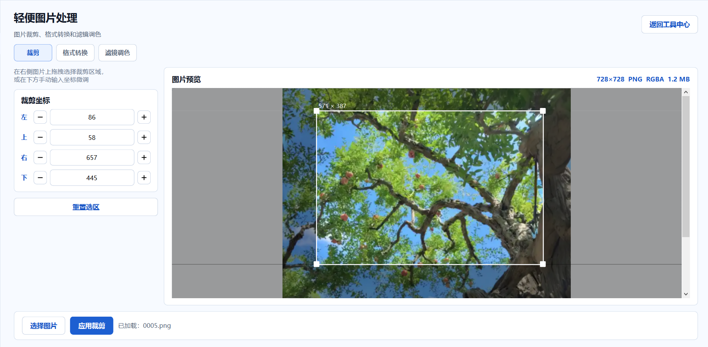

### 文件整理与重命名

批量重命名工具支持按规则生成新文件名，并在执行前展示重命名预览；文件分类整理工具支持按类型或日期自动整理文件，并提供撤销入口。

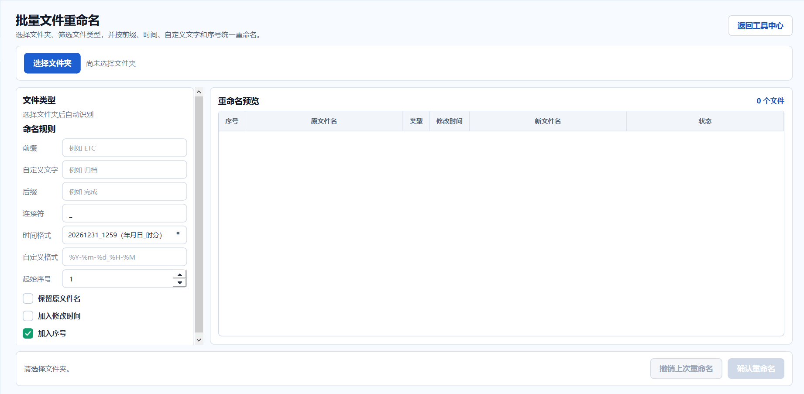

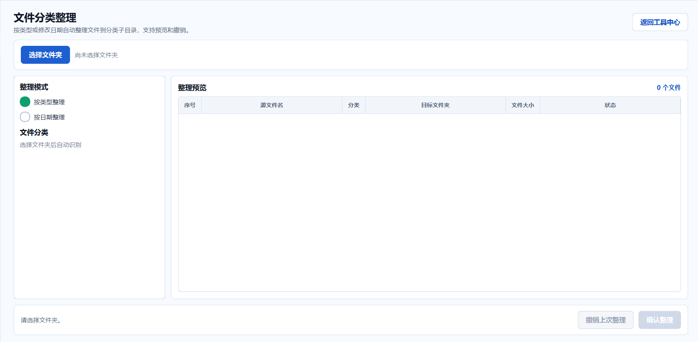

### ECF 工具箱

ECF 工具箱集中处理 ECF 相关的工程数据，包括标准测试报告、前后测试报告、温箱数据合并、温箱数据绘图和功能曲线绘制。输出结果以结构化表格形式呈现，适合测试数据复核和报告沉淀。

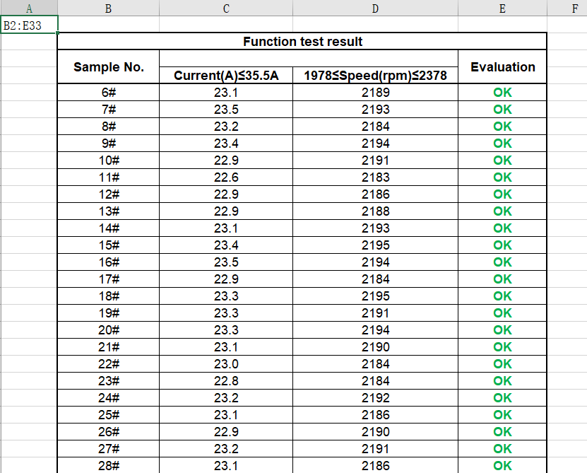

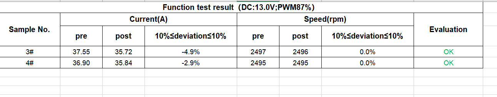

### 工时外包

工时外包模块用于绑定本地外部工具程序。用户可以手动选择 EXE，也可以扫描常用安装位置；绑定后支持打开工具、更换路径、打开所在文件夹和复制路径。

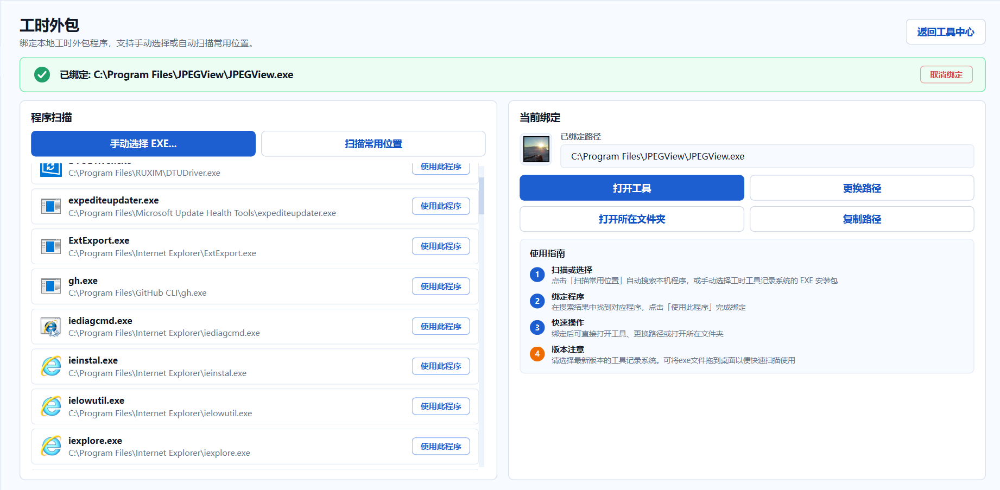

### 设置与主题

应用支持用户资料、头像、浅色/深色主题、窗口尺寸记忆和侧边栏默认折叠设置。

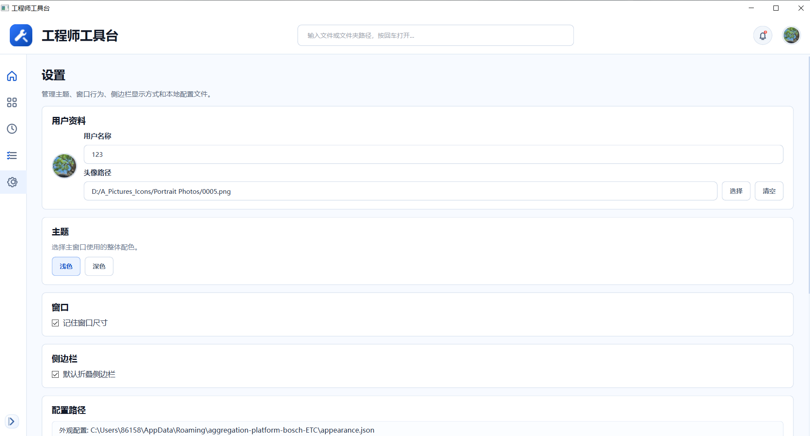

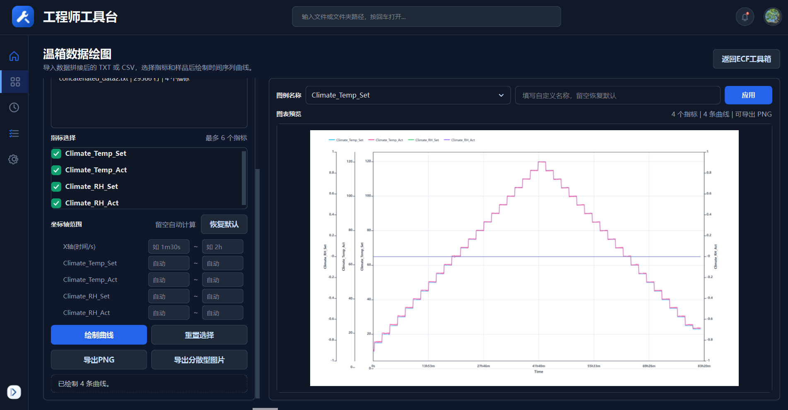

## 工程化与测试

项目将文件处理、数据转换、统计记录等逻辑从 UI 中拆出，方便单独测试。测试用例覆盖：

- 表格格式转换；
- PDF 合并、拆分与图片转 PDF；
- 批量文件重命名与撤销；
- 文件分类整理；
- 图片处理服务；
- ECF TXT 报告、前后测试报告、数据合并、温箱绘图、功能曲线；
- Todo、收藏、最近使用、设置、公告、工作量统计；
- 主窗口基础行为。

## 本地数据与隐私

- 应用偏好、外观配置、用户资料、收藏、最近使用、Todo 和公告等轻量数据保存在本机用户目录。
- 文件处理类工具以用户主动选择的文件或文件夹为输入，不依赖远程服务。
- 本仓库不包含私有业务源码、内部测试数据或构建产物，仅用于展示产品能力、界面形态和工程组织方式。

## 适用场景

- 工程测试数据的快速清洗、转换和报告整理；
- 项目文件、截图、表格和 PDF 的批量归档；
- 高频小工具的统一入口管理；
- 团队内部工具平台的原型展示或功能说明；
- 求职作品集中展示桌面应用、文件处理、数据处理和工程化能力。

